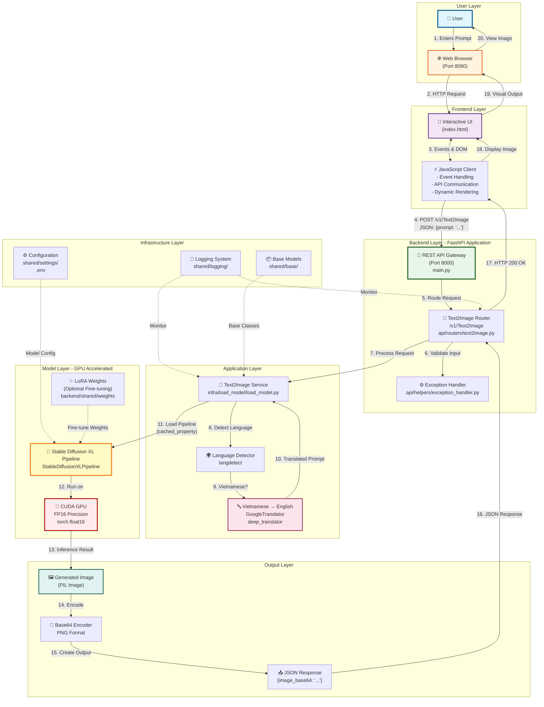

HIT Product 2025
# GenImageAI
A system that generates high-quality images from natural language text prompts

## 📋 Overview

This project implements a full-stack application featuring:

- A FastAPI backend serving the text-to-image model for inference
- An HTML/CSS/JavaScript frontend for interactive prompt input and image display
- Integration with a translation module to support multilingual prompts
- GPU acceleration for fast image synthesis using Stable Diffusion XL
- Docker for containerization and easy deployment

## 🏛️ System Architecture



### 🔄 Data Flow Summary

1. **User Input**: User enters a text prompt (Vietnamese or English) in the web interface
2. **Frontend Processing**: JavaScript captures and sends the prompt via POST request
3. **API Gateway**: FastAPI receives and routes the request to Text2Image endpoint
4. **Language Processing**: 
   - Detects if prompt is in Vietnamese
   - Translates to English if needed (improves generation quality)
5. **Model Inference**: 
   - Loads cached Stable Diffusion XL pipeline with LoRA weights
   - Runs inference on GPU with FP16 precision
6. **Image Encoding**: Converts PIL image to base64-encoded PNG
7. **Response Delivery**: Returns JSON with base64 image to frontend
8. **Display**: JavaScript decodes and displays the generated image

## ⚙️ Components

### Backend

- **FastAPI Application**: REST API with structured routes
- **Text2Image Service**: Implements text-to-image generation using the Stable Diffusion XL pipeline with optional LoRA weights for fine-tuning
- **Prompt Language Detection and Translation**: Automatically detects if the input prompt is in Vietnamese and translates it to English to improve generation quality
- **Model Management**: Loads and caches the Stable Diffusion XL model with FP16 precision on GPU for efficient inference.
- **Image Encoding**: Converts generated images to base64-encoded PNG format for easy API response handling.

### Frontend

- **Static index.html**: The user interface is built with a simple static index.html file for ease of use and deployment.

## 🚀 Getting Started

### Prerequisites

- Docker and Docker Compose
- Hugging Face Transformers and Diffusers libraries
- safetensors library for loading LoRA weights
- Pretrained SDXL base model

### Installation

1. Clone the repository:
   ```bash
   git clone <repository-url>
   cd HIT_LungTung
   ```

2. Set up environment variables:
   ```bash
   cp .env.template .env
   ```

   Then, edit the `.env` file to configure your personal settings with the following content:
   ```
   T2I__BASE_MODEL_ID='YOUR_BASE_MODEL_ID'
   T2I__LORA_WEIGHTS='shared/weights'

   ```
3. Setup Model Files
- Create a folder named `weights` inside the folder: backend\shared
- Download the model file from this Google Drive link: https://drive.google.com/file/d/1xrItYfDMEhbO3C2FTOrXF6e0nVHQleLc/view?usp=drive_link

3. Start the application using docker compose:
    ```
    docker compose up --build
    ```
## 🏗️ Project Structure
```
├── backend                         # Backend FastAPI application
│   ├── api/                        # Contains API-related files, e.g., routes, API helpers
│   ├── application/                # Core application logic and service layer
│   ├── domain/                     # Entities and core business logic of the system
│   ├── infra/                      # Infrastructure components, e.g., DB connection, external services, system config
│   ├── shared/                     # Modules, functions, configs shared across the project
│   ├── test/                       # Test files (unit tests, integration tests)
│   ├── Dockerfile                  # Docker configuration file to build backend container
│   ├── main.py                     # Main entry point of backend application (e.g., FastAPI app initialization)
│   └── requirements.txt            # List of Python dependencies to install
├── frontend                        # Frontend application
│   ├── __init__.py                 # Package initializer for frontend (can be empty)
│   ├── index.html                  # Main web interface file of the frontend
│   └── Logo.png                    # Logo image used in frontend or displayed on UI
├── .dockerignore                   # Docker ignore file
├── docker-compose.yml              # Docker Compose config for orchestrating services
├── pyproject.toml                  # Python project configuration file
└── README.md                       # Project documentation

```

## 💻 Usage

Once the application is running:

1. Access the frontend at: http://localhost:8080
2. The backend API is available at: http://localhost:8000
